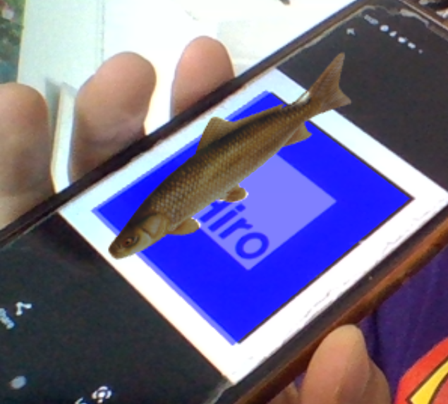

# AR Test

This project consists of a web app based on AR.js to display 3d objects with augmented reality in the browser.

When you open the project in the browser and allow access to the camera, the app will look for a marker (which you can find in `/markers/hiro.png`).
When the marker is found the app will show a fish on that marker:

# Tasks

### Adding dishes

In the `/models` folder you are given 2 other 3d models (chicken and pizza).
Your task is to add 3 buttons to the UI that trigger the appearance of each of the 3 models provided (fish, pizza and chicken) so that the user can choose which dish to see.  
Each time the user selects one of the models the other 2 models should be unselected.

### Animating the dishes

The second task consists of making the dish rotate slowly when it is shown.